# CLAUDE.md

This file provides guidance to Claude Code (claude.ai/code) when working with code in this repository.

## Module map

```mermaid
graph TD
    A["(root) xpcsjax"] --> CLI["cli"];
    A --> CFG["config"];
    A --> CORE["core"];
    A --> DATA["data"];
    A --> DEV["device"];
    A --> GUI["gui"];
    A --> IO["io"];
    A --> OPT["optimization"];
    A --> RT["runtime"];
    A --> SVC["service"];
    A --> UTIL["utils"];
    A --> VIZ["viz"];

    click CLI "./xpcsjax/cli/CLAUDE.md" "cli module doc"
    click CFG "./xpcsjax/config/CLAUDE.md" "config module doc"
    click CORE "./xpcsjax/core/CLAUDE.md" "core module doc"
    click DATA "./xpcsjax/data/CLAUDE.md" "data module doc"
    click DEV "./xpcsjax/device/CLAUDE.md" "device module doc"
    click GUI "./xpcsjax/gui/CLAUDE.md" "gui module doc"
    click IO "./xpcsjax/io/CLAUDE.md" "io module doc"
    click OPT "./xpcsjax/optimization/CLAUDE.md" "optimization module doc"
    click RT "./xpcsjax/runtime/CLAUDE.md" "runtime module doc"
    click SVC "./xpcsjax/service/CLAUDE.md" "service module doc"
    click UTIL "./xpcsjax/utils/CLAUDE.md" "utils module doc"
    click VIZ "./xpcsjax/viz/CLAUDE.md" "viz module doc"
```



The 12 module `CLAUDE.md` files above (and `.claude/index.json`) are generated locally and are **not** part of this repo — like the root file you're reading, module `CLAUDE.md`s match this project's `.gitignore` "local-only AI scratch" policy, but unlike the root file they were not force-added as a tracked exception. The `click` links resolve on a machine that has generated them; on a fresh clone or on GitHub they won't exist. Regenerate them locally (e.g. via `/ccg:init`) if you want the per-module detail.

| Module | Path | Responsibility |
|---|---|---|
| cli | `xpcsjax/cli/` | argparse CLI surface: config generation, data pipeline, NLSQ run orchestration, plot dispatch |
| config | `xpcsjax/config/` | `ConfigManager`, parameter registry/space/manager, physics validators — single source of truth for parameter names/bounds (see "Analysis modes and config templates" below for the deep dive) |
| core | `xpcsjax/core/` | Physics models (`HomodyneModel`, `HeterodyneModel`), JAX g1/g2 kernels, diagonal correction |
| data | `xpcsjax/data/` | XPCS HDF5 loading (`aps_old`/`aps_u`), phi/angle filtering, quality control, NPZ caching |
| device | `xpcsjax/device/` | CPU-only HPC device detection & thread/NUMA optimization (GPU support removed) |
| gui | `xpcsjax/gui/` | PySide6 desktop workbench; JAX-free process, delegates fits to a worker subprocess via `service` |
| io | `xpcsjax/io/` | Result/data serialization: JSON-safe helpers, NLSQ NPZ/JSON writers |
| optimization | `xpcsjax/optimization/` | JAX-native NLSQ engine: strategy routing, 5-layer anti-degeneracy controller, CMA-ES/multistart escapes (see the "NLSQ engine" section below, which also covers the 5 anti-degeneracy layers — this is the most deeply covered module in this file already) |
| runtime | `xpcsjax/runtime/` | System validation (CPU/RAM/JAX/deps) + shell completion & XLA env activation scripts |
| service | `xpcsjax/service/` | Headless, argparse/Qt-free orchestration seam shared by CLI and the GUI worker (fit/data/config/plots/persist/events) |
| utils | `xpcsjax/utils/` | Logging primitives, async I/O helpers, path validation |
| viz | `xpcsjax/viz/` | Lazy-loaded NLSQ result plotting (matplotlib/datashader) + diagnostic overlays |

Each module's `CLAUDE.md` covers: responsibility / entry points & startup / public interface / key dependencies & config / data model / tests & quality / FAQ / related files. Deep architectural narrative for `optimization`/`core`/`config` lives in this root file (below) — the module docs for those three are intentionally short and point back here rather than duplicating it. `.claude/index.json` (also local-only, see above) holds the machine-readable module index, scan coverage, and gap list (generated 2026-07-20).

## Project scope and what it is *not*

**xpcsjax is NLSQ-only by design.** v0.1 ports the homodyne + heterodyne XPCS NLSQ pipelines into one JAX-native package. Bayesian sampling — NumPyro, BlackJAX, ArviZ, CMC (Consensus Monte Carlo), NUTS, HMC, parallel tempering — is **permanently out of scope.** Users needing Bayesian XPCS analysis should use the upstream `homodyne` or `heterodyne` packages, not this one.

The architectural rule this implies:

- **Do not wire up any Bayesian / MCMC / CMC pathway.** The homodyne port's CMC/MCMC machinery (`get_cmc_config`, `_get_default_cmc_config`, the `"mcmc"` config block) has been **removed** — those symbols no longer exist anywhere in the package. What remains are a handful of docstrings and **defensive guards** that *name* Bayesian sampling only to state it is out of scope (e.g. the `ValueError` in `xpcsjax/data/optimization.py` that rejects non-NLSQ methods). Keep those — they reject invalid input, they are not dead code. Don't add new Bayesian call sites and don't write tests that exercise one.
- New optimization code goes through `fit_nlsq` (the v0.1 single-entry wrapper) or `fit_nlsq_jax` / `fit_nlsq_multistart`. There is no second optimizer pathway to "fall back to."

### Intentional v0.1 cuts from the homodyne port

Two homodyne modules were deliberately not ported. Don't flag their absence as parity gaps or port them on speculation:

- **`homodyne/optimization/checkpoint_manager.py` is not ported.** Resumable long-running NLSQ jobs are out of scope for v0.1 — re-launch rather than resume. JAX's stateless / JIT-pure-function idiom makes mid-run checkpoint/restore awkward, and the workloads xpcsjax targets fit in a single CPU-bound run.
- **`homodyne/core/scaling_utils.py` is not ported.** Its quantile / contrast helpers are only used by homodyne's CMC / MCMC path, which is permanently out of scope for xpcsjax. The NLSQ path uses the mirrored `compute_quantile_per_angle_scaling()` in `xpcsjax/optimization/nlsq/parameter_utils.py:345`.

## Architecture you need to know before editing

### Public API is lazy-loaded via `__getattr__`

`xpcsjax/__init__.py` does **not** import its public symbols at module top-level. Seven names are registered in `_LAZY_EXPORTS` and resolved on first attribute access via a module-level `__getattr__`:

```python
_LAZY_EXPORTS = {
    "load_xpcs_data":     "xpcsjax.data",
    "fit_nlsq":           "xpcsjax.optimization.nlsq",
    "ConfigManager":      "xpcsjax.config",
    "generate_nlsq_plots": "xpcsjax.viz",
    "HomodyneModel":      "xpcsjax.core",
    "HeterodyneModel":    "xpcsjax.core",          # public lazy export (Phase 6)
    "OptimizationResult": "xpcsjax.optimization.nlsq.results",
}
```

Adding a new public symbol means: (a) add it to `_LAZY_EXPORTS`, (b) add to literal `__all__`, (c) ensure the target submodule actually exposes the symbol (the runtime `assert` will catch (a)/(b) drift but not (c)). Pyright's `reportUnsupportedDunderAll` requires `__all__` to be a literal list, so don't generate it from `_LAZY_EXPORTS`.

`generate_nlsq_plots` is the one viz symbol re-exported at the top level (in `_LAZY_EXPORTS`). The rest of `xpcsjax.viz` is a separate lazy-loaded subpackage; import those directly:
`from xpcsjax.viz import plot_nlsq_fit, plot_residual_map, plot_simulated_data, generate_nlsq_plots, compute_diagonal_overlay_stats, DiagonalOverlayResult`

`xpcsjax/config/parameter_registry.py` is the single source of truth for parameter names, bounds, and physical constraints across all modes. When adding a new physics parameter, register it there first — `ConfigManager` and the NLSQ bounds builder both read from the registry.

### `xpcsjax/__init__.py` sets JAX environment **before any JAX import**

The module top sets:
- `JAX_ENABLE_X64=1` (parameters span 6+ orders of magnitude — float32 is unsafe)
- `XLA_FLAGS` including `--xla_force_host_platform_device_count=<N>` (parallel paths; `N` is concurrency-aware — `4` for a lone fit, `1` under detected concurrency via `_detect_worker_count`/`_xla_host_device_count`, keyed on `XPCSJAX_FIT_CONCURRENCY`/`PYTEST_XDIST_WORKER_COUNT`) and `--xla_disable_hlo_passes=constant_folding` (avoids > 1 s slow-compile warnings on HYBRID_STREAMING with 23M+ points)
- `NLSQ_SKIP_GPU_CHECK=1` (v0.1 is CPU-only; GPU support is v0.2+)

If you need to add or amend these flags, do it **inside `xpcsjax/__init__.py` only** — adding env-mutation elsewhere will race the first JAX import.

### NLSQ engine: xpcsjax owns strategy, NLSQ owns the trust-region solve

The split with the upstream NLSQ library (`nlsq>=0.6.10`) is:

- **NLSQ owns:** `CurveFit` JIT cache, `curve_fit()`, the trust-region (Levenberg-Marquardt) solve. `WorkflowSelector` was removed in NLSQ v0.6.0 — do **not** call it.
- **xpcsjax owns:** memory-aware strategy routing (`select_nlsq_strategy`), the 5-layer anti-degeneracy controller (`anti_degeneracy_controller.py`), CMA-ES escape (config-gated — homodyne additionally requires the parameter bounds' scale ratio to exceed a static threshold; heterodyne's flat `enable_cmaes` is flag-only — decided before the solve runs, never a runtime auto-trigger), LHS multistart, bounds + parameter transforms, angle-stratified chunking for large datasets, and shear-weighting.

When working inside `xpcsjax/optimization/nlsq/`, the convention is: call NLSQ's `CurveFit` directly, never NLSQ's higher-level `fit()` unified API or its `MemoryBudgetSelector`. xpcsjax routes memory itself.

**`wrapper.py`, `heterodyne_core.py`, and `core.py` are large by design, not by neglect — but the expected pattern is incremental extraction, not "leave it alone."** These three files sit at the optimization engine's central seams (joint-fit dispatch, per-angle-mode routing, global-escape wiring) and together carry roughly 11K lines / 620+ branch points. Do not attempt a wholesale rewrite — the `rtol=1e-10` golden parity tests (`tests/parity/_golden/`) make broad restructuring high-risk for low near-term payoff. The established convention instead is **incremental, parity-gated extraction of cohesive sub-blocks into their own module, one PR at a time** — `heterodyne_stratified_ls.py` and `heterodyne_result_builder.py` are precedents for splitting a separable concern into its own per-concern module as the feature grew, each verified against the existing golden/parity suites (note: per git history, these were introduced as new modules alongside `heterodyne_core.py` changes, not literal cut-and-shrink extractions from it — treat them as the target shape to converge toward, not a diff template to copy). If you're touching one of these files and see an obviously separable concern (a dispatch table, a self-contained helper, a result-assembly branch), splitting it into its own module is the expected next step, not scope creep.

The 5 anti-degeneracy layers, in order:

| Layer | Name | Module | Active modes |
|-------|------|--------|-------------|
| L1 | Per-Angle Reparameterization | `per_angle_mode.py` | all |
| L2 | Hierarchical Optimization | `hierarchical.py` | all |
| L3 | Adaptive CV-based Regularization | `adaptive_regularization.py` | all |
| L4 | Gradient Collapse Monitoring | `gradient_monitor.py` | all |
| L5 | Shear-Sensitivity Weighting | `shear_weighting.py` | `laminar_flow` only |

Layer gating is declared in `_LAYER_GATES` at the top of `anti_degeneracy_controller.py`. Layers absent from that dict are default-active for all modes; only L5 is gated. L5 up-weights data near the flow direction φ0 to exploit the shear-sensitivity peak, which exists only when the kernel has a shear rate — so L5 is active for `laminar_flow` **only**. The static modes (`static_anisotropic`, `static_isotropic`) have no flow direction and `two_component` (heterodyne) has no shear rate, so L5 short-circuits for all of them. Note `is_layer_active()` still returns `True` for every layer when `analysis_mode=None` (the homodyne characterization gate's path), so this gating does not affect the rtol=1e-10 parity baselines.

**L2's `jaxopt` dependency is unmaintained upstream; no migration timeline is set.** L2's bounded L-BFGS warm-start (`hierarchical.py`) uses `jaxopt`, which upstream no longer maintains — its `DeprecationWarning` is suppressed both at the import site and globally in `pyproject.toml`'s pytest config. The planned replacement is `optimistix`, but it is **not currently an xpcsjax dependency** (verified: absent from `pyproject.toml`/`uv.lock`, `import optimistix` fails) — it would need to be added. Don't confuse this with `core.py`'s module docstring, which records that xpcsjax's *main NLSQ solve* previously migrated **away from** Optimistix to the NLSQ package; that was a separate, unrelated migration, so reintroducing `optimistix` here (scoped to L2's warm-start only) is a new addition, not a revert. No PR or issue tracks this jaxopt→optimistix migration yet; it is an accepted, undated v0.1 carry-over, not scheduled work.

L4 is a **per-iteration gradient-collapse monitor** (`build_gradient_collapse_callback` feeding `GradientCollapseMonitor`), a **shared mechanism** with behavioral parity between `laminar_flow` and `two_component`. It is **strictly diagnostic** — monitor-on vs monitor-off is bit-identical (the homodyne rtol=1e-10 baselines included). When the solver callback never fires it falls back to a **post-solve covariance-condition** check; the `gradient_monitor` diagnostics block's `mechanism` field reports which path ran (`per_iteration_gradient_ratio` vs `post_solve_fallback`), and `gradient_consecutive_triggers` is now effective. Per-iteration is wired on the standard joint-fit path of both modes; the ≥1 M stratified tier is not yet wired (documented follow-up).

The anti-degeneracy *diagnostics contract* is now symmetric across modes: both `laminar_flow` and `two_component` emit the same top-level `nlsq_diagnostics` activation keys (`hierarchical_active`, `regularization_active`, `shear_weighting`, + `gradient_monitor` when L4 ran) via the shared `assemble_anti_degeneracy_diagnostics` (`xpcsjax/optimization/nlsq/anti_degeneracy_diagnostics.py`). The flat top-level keys are emitted at all dataset sizes — every laminar path (in-memory, HYBRID_STREAMING, stratified-LS ≥1 M, sequential, out-of-core) plus all heterodyne paths (in-memory, STREAMING) — with honest per-path values: both laminar and heterodyne HYBRID_STREAMING report the real active L2/L3 they ran; stratified-LS/sequential/out-of-core report inactive markers (`hierarchical_active=False`, `regularization_active=False`, `shear_weighting="laminar_flow_inactive"`) since those layers don't run there. **(2026-06-05) The heterodyne `two_component` ≥1 M stratified-LS path now also *instantiates* the shared `AntiDegeneracyController` (best-effort, banner side-effect only — `_emit_anti_degeneracy_parity_banners` in `heterodyne_stratified_ls.py`, fed the raw `anti_degeneracy` dict threaded from the dispatcher) so its log emits the same `ANTI-DEGENERACY: Layer 2/3/4` + mode banners `laminar_flow` emits (verified on real C044). This is configured-not-executed: the single numeric solve and SSR are unchanged, and the flat `hierarchical_active`/`regularization_active` markers stay `False` exactly as above — laminar reports the same on its own stratified path. The banners fire only for the nested `optimization.nlsq.anti_degeneracy:` config block (xpcsjax format, e.g. `xpcsjax_config.yaml`); the flat `enable_hierarchical:` upstream format yields no nested block, so `nlsq_dict.get("anti_degeneracy")` is `None` and the helper no-ops. L5 stays gated off for `two_component`.**

### Analysis modes and config templates

xpcsjax ships four mode-specific YAML templates under `xpcsjax/config/templates/`:

| Mode | Template file |
|------|--------------|
| `static_anisotropic` | `xpcsjax_static_anisotropic.yaml` |
| `static_isotropic` | `xpcsjax_static_isotropic.yaml` |
| `laminar_flow` | `xpcsjax_laminar_flow.yaml` |
| `two_component` | `xpcsjax_two_component.yaml` |

`ConfigManager` uses **deferred** mode validation: an unknown `analysis_mode` is stored and *warned* at construction (not rejected), and only raises `ValueError` later — on `.analysis_mode` property access (`AnalysisMode(value)`) or on the registry/`ParameterManager` lookups that consume it. (Verified 2026-06-05; the lenient construction is intentional — see the comments around `_normalize_analysis_mode`.) `data_type` is likewise **not** validated by `ConfigManager`; the closed `aps_old`/`aps_u` vocabulary lives in `config/types.py` (`DataType` Literal) and is auto-detected by the loader.

**`data_type` valid values:** `"aps_old"` (legacy APS format) or `"aps_u"` (unified APS format). No other strings are accepted.

### Homodyne parity is synthetic-only (real-data oracles removed)

The upstream-homodyne **real-data parity oracles** — the C020/Simon characterization
suite (`test_homodyne_equivalence.py`, `test_homodyne_nlsq_ab_parity.py`), the C044
real-data heterodyne tests, their generated baselines, and the `scripts/` generators
(`generate_homodyne_baselines.py` et al.) — were **removed**. xpcsjax no longer
depends on the upstream `homodyne` package or the maintainer datasets (C020/Simon/C044)
for testing, and the default suite has **zero skips** from them.

Remaining parity coverage is **synthetic and committed**:
- `tests/parity/test_homodyne_engine_preservation.py` — golden snapshots under
  `tests/parity/_golden/` at `rtol=1e-10` (the model-agnostic engine seam tripwire).
- `tests/parity/test_engine_heterodyne_fit_parity.py` / `test_engine_route_result_contract.py`
  — engine-route parity on synthetic fixtures.
- `tests/parity/test_phase5_default_no_worse.py::test_synthetic_default_averaged_no_worse_than_individual`
  — the Phase-5 `auto → averaged@n_phi≥3` no-worse-SSR contract (`averaged` is
  *more constrained* — 2 scaling DOF vs `2*n_phi` — so SSR can only degrade-or-equal,
  asserted within `1e-3`), exercised on synthetic data.

These run on every `make verify` (no datasets, no env vars). The CPU-microarch-sensitive
golden value-compares self-skip on CI and are forced by `make test-full-local`
(`XPCSJAX_RUN_CHARACTERIZATION=1 XPCSJAX_RUN_ENGINE_PARITY=1`).

### Heterodyne is a fully public model with per-angle-mode parity

HeterodyneModel is a public lazy export. Phase 6 brought it to full
per-angle-mode parity with homodyne — see
`docs/source/theory/heterodyne_anti_degeneracy.rst` for the 4-layer defense
system (L5 shear-weighting is `laminar_flow`-only by design — heterodyne has
its own, structurally different velocity/flow term, so laminar_flow's
shear-sensitivity weighting does not transfer to it).

### Heterodyne per-angle modes (parity with homodyne)

| Mode | Optimizer params | When to use |
|---|---|---|
| `constant` | `n_physics` | Pre-estimate scaling, freeze |
| `auto` (default) | depends on `n_phi` | Recommended; dispatches by thresholds |
| `fourier` | `n_physics + 2(2K+1)` | Many angles, smooth angular variation |
| `individual` | `n_physics + 2·n_phi` | Many angles, large physical contrast variation |

L5 (shear weighting) is `laminar_flow`-only. Heterodyne's velocity/flow term
(`v0`, `v_offset`, `phi0_het`) is structurally different from laminar_flow's
shear rate (`gamma_dot`), so laminar_flow's shear-sensitivity weighting does
not apply to it. See `docs/source/theory/heterodyne_anti_degeneracy.rst`.

### Heterodyne joint global escapes (parity gap C closed)

The heterodyne joint CMA-ES (`_fit_joint_cmaes_multi_phi`) and joint multistart
(`_fit_joint_multistart`) escapes in `heterodyne_core.py` are **real global
escapes** (no longer the Phase-6 minimal stubs). Each runs a seed-pinned global
optimizer over the joint `[physics | scaling]` vector, **keeps-better** vs the
plain NLSQ joint fit, and **best-effort falls back** to the plain joint fit on
failure — reusing the shared `fit_with_cmaes` / `run_multistart_nlsq`. This is
the joint-fit global escape; the per-angle escapes were already real. This
closed parity gap **C** between `two_component` and `laminar_flow`. An escape
result is tagged `nlsq_diagnostics["global_escape"]` and, by construction,
carries NaN covariance / uncertainties and `n_iterations=0` (no covariance solve
on the kept vector) — read `global_escape` to detect an escape result.

**The escape honours the resolved per-angle scaling mode — it does NOT force
Fourier.** `fit_nlsq_multi_phi` resolves `effective_mode` (`_resolve_effective_mode`)
*before* the global-escape gate, so enabling CMA-ES / multistart never changes
which scaling layout is used (the consistency invariant: `auto → averaged` for
`n_phi >= constant_scaling_threshold` (3) else `individual`; `constant`/`fourier`
explicit-only — see the `per_angle_mode` templates). Routing by mode:

- **`fourier` / `individual`** escapes use the Fourier-reparam joint problem
  builder (`_fit_joint_cmaes_multi_phi` / `_fit_joint_multistart` →
  `_build_joint_problem` / `_build_joint_fourier`: `fourier` ↔ `independent`).
- **`averaged`** (the `auto` default at `n_phi >= 3`) and explicit **`constant`**
  escapes run the global search over their OWN `[physics | scaling]` data
  residual via the `global_escape_kind=` hook on `_fit_joint_averaged_multi_phi`
  / `_fit_joint_constant_multi_phi` (frozen scaling → physics-only search). The
  shared keep-better + escape-contract machinery lives in `_apply_global_escape`
  (with `_cmaes_joint_candidate` / `_multistart_joint_candidate` /
  `_solve_residual_nlsq`); when `global_escape_kind=None` those solvers are
  byte-identical to the plain path. This mirrors `laminar_flow`'s CMA-ES, which
  honours `use_averaged_scaling` (`core.py`'s `AntiDegeneracyController` path) —
  so a default `auto` fit no longer silently switches to a Fourier scaling tail
  just because a global escape was enabled.

**In-progress consolidation: the `constant`/`individual`/`averaged` joint-fit
result-assembly split is not yet unified.** `_decompose_chi2_per_angle`'s
import is now a single module-level import in `heterodyne_core.py` (from
`heterodyne_constant_mode.py`, which does not import `heterodyne_core` at its
own module level, so no cycle), shared via the `_decompose_joint_chi2_per_angle`
helper used by both `_fit_joint_averaged_multi_phi` and `_build_joint_result`
(TODO(C3)) — the narrow duplication the earlier TODO(C3) comment tracked is
resolved. The larger convergence is still open: `constant` mode builds its own
`OptimizationResult` inline in `heterodyne_constant_mode.py`, and `averaged`
uses a physics-first `[physics | contrast, offset]` vector layout instead of
the scaling-first `[scaling_head | physics]` layout `_build_joint_result`
assumes — unifying those onto one builder is tracked as the concrete next unit
of the "procedural parity" convergence work described above (the engine-route
seam), but has no named owner or decision record yet.

### Heterodyne hybrid-streaming anti-degeneracy (parity gap D closed)

The heterodyne STREAMING path previously froze the quantile-estimated per-angle
scaling inside the JIT closure and ran no anti-degeneracy layers. Gap D is now
**closed**: `fit_with_stratified_hybrid_streaming_heterodyne` optimizes the
scaling tail and runs L1–L4, mirroring `laminar_flow` streaming:

- **`per_angle_mode` dispatch** (driven by `anti_degeneracy_config.per_angle_mode`):
  `auto` is **the default**, including when `anti_degeneracy_config` is absent/`None`
  (mirrors laminar `hybrid_streaming.py:462` — no "freeze when unconfigured" special
  case). `auto` → `auto_averaged` (2 averaged scaling params) when
  `n_phi ≥ constant_scaling_threshold` (default 3), else → `individual`
  (2·n_phi per-angle params, activates L2). `fixed_constant` (frozen scaling) is the
  **explicit opt-out** via `per_angle_mode="constant"`. `fourier` → 2·(2K+1) Fourier
  coeffs (silently falls back to `individual` when n_phi < 1+2K — surfaced via
  `meta["fourier_effective_mode"]`).
- **L1** active for all optimized modes; skipped for `fixed_constant`.
- **L2** (`HierarchicalOptimizer`) gated to `individual`/`fourier` exactly mirroring
  laminar's gate. `auto_averaged`/`fixed_constant` skip L2. On the L2 branch the
  `[physics | scaling]` vector is permuted to `[per_angle | physics]` layout,
  solved, and un-permuted; covariance is an identity placeholder on this branch
  (`info["covariance_is_placeholder"] = True`).
- **L3** adaptive CV regularization active when `regularization.enable=True` and
  there is a scaling tail; group indices are mode-aware.
- **L4** gradient-collapse monitor wired via `callback=` (plain branch) and
  `_hier_grad` (L2 branch); strictly observational.
- **L5** omitted (heterodyne has no shear term); diagnostics report
  `'laminar_flow_inactive'` sentinel.
- **Parity contract:** mechanism + objective (optimized SSR ≤ frozen baseline),
  NOT `rtol=1e-10` (that gate is homodyne-specific).

Diagnostics: streaming emits the symmetric `info["anti_degeneracy"]` block
(`hierarchical_active`, `regularization_active`, `shear_weighting`,
`gradient_monitor`, `per_angle_mode`) via `assemble_anti_degeneracy_diagnostics`.

Remaining optional/structural follow-ups: **A** (routing heterodyne standard path
through the shared `AntiDegeneracyController`) and aligning heterodyne's standard-path
L2 onto `HierarchicalOptimizer` (currently an inline two-stage implementation).
Neither is required for mechanism parity; both are architectural cleanups.

**Gap A is NOT a parity gap — do not "fix" it by routing heterodyne through the
controller.** The parity target is laminar's *standard* path, and that path is
itself inline: `wrapper.py` has **zero** `AntiDegeneracyController` uses. The
controller is instantiated ONLY in laminar's CMA-ES path (`core.py:1846`, inside
`fit_nlsq_cmaes`) and stratified-LS path (`stratified_ls.py:203`) — it is
path-specific, not a universal laminar orchestrator. The laminar standard path
also runs no L2 (`wrapper.py` hard-codes `hierarchical_active=False`; the
in-memory path runs no L2/L3). So heterodyne's inline standard path already
*matches* laminar's inline standard path; routing it through the controller (or
swapping its inline two-stage L2 onto `HierarchicalOptimizer`, which both modes
already share on the streaming paths) would **create** divergence and risk
numeric drift with no rtol gate to catch it. Likewise the `shear_weighting` L5
sentinel split (`not_applicable_heterodyne` on heterodyne public surfaces vs
`laminar_flow_inactive` on the internal streaming mirror-block, translated by
`heterodyne_result_builder.py`) is a deliberate two-value design pinned by ~12
tests, not a cosmetic asymmetry to unify. (Reviewed 2026-06-01.)

> **SUPERSEDED by Phase 1 (model-agnostic engine, 2026-06-04).** The
> stratification engine (`StratifiedResidualFunctionJIT` in
> `strategies/residual_jit.py`) is now **model-agnostic** via a `PointEvaluator`
> seam (`xpcsjax/optimization/nlsq/model_adapter.py`): homodyne injects
> `compute_g2_scaled` through the default `HomodynePointEvaluator`, and the engine
> calls `evaluator.eval_points(...)` instead of hard-coding the kernel. The
> threading is behavior-preserving (guarded bit-identical by
> `tests/parity/test_homodyne_engine_preservation.py` at `rtol=1e-10`). With this
> seam in place, the **new goal is full _procedural_ parity** — running heterodyne
> through the same shared engine — which **supersedes** the "Gap A is not a parity
> gap" and "heterodyne uses its own memory module" stances above. Those stances
> remain accurate for the *pre-Phase-1* inline paths; do not treat them as a
> reason to block the procedural-parity convergence work.

### Heterodyne memory strategy and angle stratification

Heterodyne mirrors homodyne's angle-stratification mechanism (mechanism parity, not numerical parity — heterodyne fits a different model). The dispatch inside `_fit_nlsq_heterodyne` is: cmaes → multi_start → hybrid_streaming → stratified-LS (≥ 1 M points) → in-memory joint fit.

Key facts:
- **Stratified-LS (double-chunking) activates at ≥ 1 M points only.**
- **In-memory in-scope-mode fits route through the SHARED engine (Task #16b).** The in-memory joint-fit branch (< 1 M points, non-escape) of `_fit_nlsq_heterodyne` routes the three in-scope per-angle scaling modes — `fixed_constant` / `individual` / `auto_averaged` (production `constant` / `individual` / `auto`-at-`n_phi ≥ 3`, resolved via `_resolve_effective_mode`) — through `fit_two_component_via_engine` (`heterodyne_engine_route.py`), the SAME homodyne stratification engine (`StratifiedResidualFunctionJIT`) homodyne uses. This is **procedural parity**, the goal that supersedes the earlier inline-path stances. The engine route does its own frame-0 exclusion + stratification. **This CHANGES `two_component` in-memory in-scope-mode results by ~1e-3 vs the old direct `fit_nlsq_multi_phi` path** — the accepted **no-worse** contract (engine SSR ≤ production SSR; three-brain + real-data C044 verified), **NOT bit-identical**. `fixed_constant` is strict-parity (same frozen scaling → identical physics-only problem); `individual`/`auto_averaged` are no-worse within ~1e-3. The call is **best-effort**: any engine-route exception logs a warning and falls back to `fit_nlsq_multi_phi`, so a routing failure never breaks a fit. **`fourier` stays on `fit_nlsq_multi_phi`** (the engine route raises `NotImplementedError` for it). **This exclusion has no named owner or decision record — it is not yet decided whether it is permanent or a pending follow-up**; do not treat the `NotImplementedError` as evidence either way without checking with the maintainer first. The CMA-ES / multistart / hybrid-streaming / stratified-LS (≥ 1 M) branches are unchanged. The superseded seed-42 angle-shuffle regime (`_seed42_angle_reorder` / `_restore_angle_order` + `tests/heterodyne/test_shuffle_regime_parity.py`) was **removed** — the engine route's own stratification supersedes it.
- **Off-grid guard is obsolete** on the engine path: `HeterodynePointEvaluator` (`model_adapter.py`) passes through to the **meshgrid** kernel `compute_c2_heterodyne` over the full per-angle grid — it does NO value→index `_nearest_index`/`searchsorted`/`argmin` mapping, so there is no off-grid scatter hazard to guard.
- **The engine route still uses the MESHGRID evaluator on purpose; a pointwise evaluator exists but is deliberately NOT wired into the production solve.** `model_adapter.py` ships `HeterodynePointwiseEvaluator` (advertises `supports_scattered=True`; `eval_scattered` → `compute_c2_heterodyne_pointwise`) and `StratifiedResidualFunctionJIT` has a scattered branch (gated on `getattr(evaluator, "supports_scattered", False)` + per-angle scaling) that evaluates theory ONLY at a chunk's `(phi_idx, t1_idx, t2_idx)` support points — no dense `(n_phi, n_t, n_t)` grid. It is **tested** (`tests/optimization/test_pointwise_evaluator_seam.py`: scattered == meshgrid-gather to ~1 ULP) but `fit_two_component_via_engine` still injects the meshgrid `HeterodynePointEvaluator`. **Do not flip it to pointwise:** although the pointwise theory values match the meshgrid kernel to ~1 ULP, swapping it flips the non-convex `trf`+`soft_l1` two_component solve into a worse basin on the degenerate maintainer fixtures (`test_engine_route_objective_no_worse`, 20×–2000× worse χ², all three modes) — the same CPU-microarch basin-fragility documented for engine-route parity. The scattered branch + evaluator are kept as a tested seam for a future solver robust to it; homodyne (`laminar_flow`) never advertises `supports_scattered`, so its grid path stays bit-identical.
- **Unweighted heterodyne fits carry a `sigma=None` sentinel, not a dense ones array.** `build_heterodyne_stratified_data(..., weights=None)` sets `sigma=None` instead of `np.ones((n_phi, n_t, n_t))`; the engine-route frame-0 reducer (`heterodyne_engine_route.py`) preserves the `None` through reduction, and `StratifiedResidualFunctionJIT.__init__` branches on it (`_sigma_is_unit=True` → `jnp.ones_like(...)` in the residual). This is **numerically exact** (unit sigma ≡ ones → identical residuals/trajectory, no basin risk) and removes the dense allocation on both the `< 1 M` engine route and the `≥ 1 M` stratified-LS path (which already guarded `sigma is not None`). Weighted fits (real sigma) are unaffected.
- **Config:** `optimization.stratification.{enabled="auto", target_chunk_size=100000, max_imbalance_ratio=5.0, ...}` in the mode YAML. `enabled: false` reverts to in-memory joint fit at all sizes.
- New module: `xpcsjax/optimization/nlsq/heterodyne_stratified_ls.py` (`fit_heterodyne_stratified_least_squares`).
- See `docs/source/theory/heterodyne_memory_strategy.rst` for the full decision table and config reference.

## Commands

Use the project Makefile rather than reinventing pytest/ruff invocations — the targets are tuned for this layout (domain-sharded tests, not pyramid layers).

| Action | Command |
|---|---|
| Install dev deps | `make dev` (= `uv pip install -e ".[dev]"`) |
| Run all tests | `make test` |
| Run a single test file | `uv run pytest tests/optimization/test_nlsq_core.py -v` |
| Run a single test | `uv run pytest tests/optimization/test_nlsq_core.py::test_name -v` |
| Domain-scoped tests | `make test-core` · `make test-optimization` · `make test-heterodyne` · `make test-characterization` · `make test-property` · `make test-viz` (pytest-mpl snapshot comparison) |
| Fast smoke | `make test-smoke` |
| Pre-push gate | `make verify` (lint + advisory mypy + smoke under `-x -n auto`) |
| Lint | `make lint` (ruff, line-length 100, `E,F,W,I,B,UP,N`) |
| Type-check | `make type-check` (mypy non-strict, `ignore_missing_imports=true`) |
| Format | `make format` (ruff format + `ruff check --fix`) |
| Verify NLSQ integration end-to-end | `make verify-nlsq` |
| FULL run (forces synthetic parity gates) | `make test-full-local` |
| Run heavy (slow/flaky) nodes serially | `make test-heavy-serial` |

Notes:
- `pytest` auto-loads `JAX_ENABLE_X64=1` from `[tool.pytest.ini_options]` — no need to set it manually for tests.
- **There are no real-data / upstream-homodyne oracles anymore.** The C020/Simon/C044 live-fit tests and the env-gated characterization + A/B-parity suites were removed, so `make test`/`make verify` need **no datasets, no upstream `homodyne`, and report zero skips** from them. The surviving parity tests are synthetic (see "Homodyne parity is synthetic-only" above).
- **`make test-full-local` only forces the CPU-microarch-gated SYNTHETIC parity tests** (the engine-route strict-numeric parity + the `test_homodyne_engine_preservation` golden value-compare) via `XPCSJAX_RUN_CHARACTERIZATION=1 XPCSJAX_RUN_ENGINE_PARITY=1`. Those self-skip on CI (golden values are recorded on a specific CPU) and are otherwise the only thing the default suite leaves un-forced. No data root, no upstream package. Config `data_folder_path` still resolves `${ENV_VAR}`/`~` (no-op on plain absolute paths) for normal data loading. **Do not add a GitHub-hosted CI job that forces `XPCSJAX_RUN_ENGINE_PARITY=1`** — both golden files (`tests/parity/test_homodyne_engine_preservation.py`, `tests/parity/test_engine_heterodyne_fit_parity.py`) document this as verified-non-reproducible on GitHub's Ubuntu runners (different XLA:CPU codegen/BLAS backend from the maintainer's dev machine), so a hosted job would be permanently red with no real signal. `make test-full-local` stays a maintainer-local pre-release check (run it manually before tagging a release) unless a self-hosted runner pinned to the goldens' recording machine is ever set up.
- `make type-check` will surface many findings because `strict = false`; `make verify` runs mypy in **advisory** mode (`| tail -1 || true`) so type findings don't block push.
- Python 3.12+ required (per `pyproject.toml`).
- **A few slow/flaky SYNTHETIC nodes are serial-routed out of every `-n auto` target.** `PARALLEL_DESELECT` (top of the Makefile) `--deselect`s the `HEAVY_NODES` (currently a CMA-ES escape test + a GUI worker-handle test) from **all** parallel targets; they run serially via `make test-heavy-serial`, and `make test-all-parallel` chains it after the parallel pass. `HEAVY_FILES`/`ENV_GATED_FILES` are now **empty** (the real-data oracles that populated them were removed). Do **not** `--ignore` a file that also holds cheap tests — use `--deselect` on the specific node instead. The per-fit memory budget is also concurrency-aware (divides `available*fraction` by `PYTEST_XDIST_WORKER_COUNT`/`XPCSJAX_FIT_CONCURRENCY`).

## Workflow conventions

- **uv-first.** `uv.lock` is the source of truth; never run bare `pip install`. The Makefile auto-detects `uv` and uses `uv run` to route through `.venv`.
- **Float64 everywhere.** `JAX_ENABLE_X64=1` is mandatory — parameters span 6+ orders of magnitude.
- **No `from module import *`.** Enforced by user CLAUDE.md and by ruff (`F` rule).
- **JIT-safe interpolation only.** `interpax` is not currently a dependency (nothing in the codebase interpolates); if a JIT'd path ever needs interpolation, add `interpax` for it — never use `jax.numpy.interp` in JIT'd paths.
- **Parity coverage is synthetic — the real-data/upstream-homodyne oracles were removed.** The Phase-5 no-worse band (`chi2_default <= chi2_individual * (1 + 1e-3)`; `averaged` is more-constrained, so a small SSR degradation is the *intended* default change, not a regression) is checked synthetically by `tests/parity/test_phase5_default_no_worse.py::test_synthetic_default_averaged_no_worse_than_individual` — do **not** "fix" that band by forcing it to bit-identity. The engine seam is pinned by `tests/parity/test_homodyne_engine_preservation.py` goldens (`tests/parity/_golden/`, `rtol=1e-10`); if a strict golden value-compare fails after a port change, regenerate the golden only if the kernel legitimately changed — never loosen the tolerance. There is no longer any `XPCSJAX_RUN_CHARACTERIZATION` / `XPCSJAX_RUN_AB_PARITY` live fit against upstream `homodyne`.

## graphify

This project has a graphify knowledge graph at `graphify-out/`.

- Before answering architecture or codebase questions, read `graphify-out/GRAPH_REPORT.md` for god nodes and community structure.
- If `graphify-out/wiki/index.md` exists, navigate it instead of reading raw files.
- For cross-module "how does X relate to Y" questions, prefer `graphify query "<question>"`, `graphify path "<A>" "<B>"`, or `graphify explain "<concept>"` over grep — these traverse the graph's EXTRACTED + INFERRED edges instead of scanning files.
- After modifying code files in this session, run `graphify update .` to keep the graph current (AST-only, no API cost).

## Agent skills

### Issue tracker

GitHub Issues (imewei/xpcsjax), via `gh` CLI. See `docs/agents/issue-tracker.md`.

### Triage labels

Default five canonical labels (needs-triage, needs-info, ready-for-agent, ready-for-human, wontfix). See `docs/agents/triage-labels.md`.

### Domain docs

Single-context (`CONTEXT.md` + `docs/adr/` at repo root). See `docs/agents/domain.md`.
