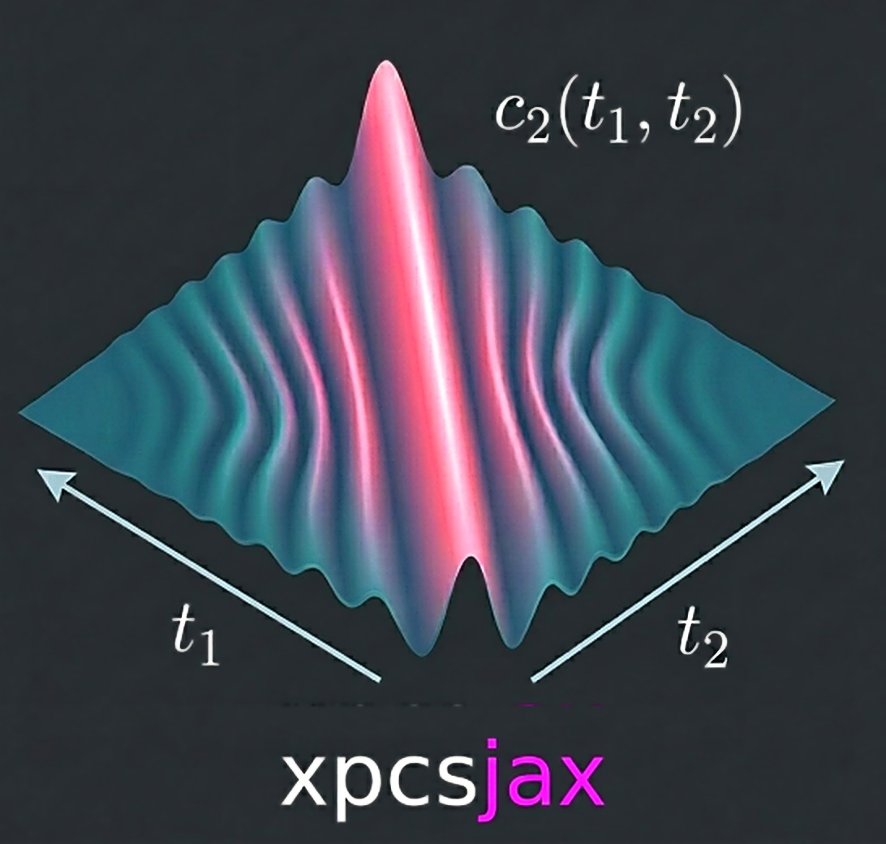

# XPCSJAX - JAX-native NLSQ fitting for XPCS.

<p align="center">
  
</p>

[](https://badge.fury.io/py/xpcsjax)
[](LICENSE)
[](https://www.python.org/)
[](https://xpcsjax.readthedocs.io)

> **Disclaimer:** XPCSJAX is pre-release software under active development and testing. APIs, model implementations, and numerical results may change without notice. Outputs have not been independently validated for all use cases. Use at your own risk and verify critical results against established reference data before relying on them in research or industrial applications.

XPCSJAX consolidates the homodyne and heterodyne analysis pipelines — both now
deprecated in its favor — into one package with a shared engine and config-driven
physics-model dispatch. It implements the transport-coefficient framework of
[He et al. PNAS 2024](https://doi.org/10.1073/pnas.2401162121) and
[He et al. PNAS 2025](https://doi.org/10.1073/pnas.2514216122) for characterizing
nonequilibrium dynamics in flowing soft-matter systems.

---

## Install

To get every feature and avoid missing-dependency issues, install with the `all` extra
(pulls every optional dependency — GUI, fast-viz, plus the dev/docs/packaging tooling).

With [uv](https://docs.astral.sh/uv/) (recommended):

```bash
uv pip install "xpcsjax[all]"
```

In a mamba/conda environment — or any other virtualenv (`venv`, `virtualenv`, `pyenv`) —
use pip:

```bash
pip install "xpcsjax[all]"
```

For a minimal core install (NLSQ fitting only, no GUI), drop the extra:
`uv pip install xpcsjax` or `pip install xpcsjax` — this already includes datashader-accelerated
plotting. The `xpcsjax[gui]` extra adds the desktop workbench.

Python 3.12+ required, CPU-only in v0.1 (GPU support is v0.2+). Runtime dependencies are
managed via `pyproject.toml` and mirror what the source `homodyne` package pins (versions
of `jax`, `nlsq`, `evosax`, `h5py`, `jaxopt`, `psutil`, `tqdm`, etc.).

**From source (development):** clone the repo and use an editable install —
`uv sync && uv pip install -e ".[dev]"`. See
[`docs/source/development/contributing.rst`](docs/source/development/contributing.rst).

---

## Quickstart

```python
from xpcsjax import load_xpcs_data, fit_nlsq

data   = load_xpcs_data("config.yaml")
result = fit_nlsq(data, "config.yaml")
print(result.parameters)
```

The YAML config's `analysis_mode` field selects the physics model and parameter set:

| `analysis_mode` | Lineage | Model | Physics params |
|---|---|---|---|
| `static_isotropic` | homodyne | Equilibrium diffusion, angle-collapsed | 3 |
| `static_anisotropic` | homodyne | Same physics; angle-resolved data prep | 3 |
| `laminar_flow` | homodyne | Diffusion + sinc-shear | 7 |
| `two_component` (or `heterodyne`) | heterodyne | Two-component: reference + sample + velocity + mixing | 14 |

`fit_nlsq` returns a single `OptimizationResult` for every mode (`result.parameters` is a
NumPy array). Heterodyne (`two_component`) fits all phi angles jointly and packs the
multi-angle result into that same object. Two per-angle scaling parameters (`contrast`,
`offset`) are appended automatically for every azimuthal angle in all modes.

### Data flow

```
YAML config --> XPCSDataLoader(HDF5) --> HomodyneModel / HeterodyneModel --> NLSQ engine --> Results (JSON + NPZ)
```

`save_results` (`xpcsjax/service/persist.py`) writes `nlsq_result.json` (fitted
parameters, uncertainties, χ², diagnostics) and `nlsq_result.npz` (correlation and
residual arrays) to the configured output directory.

---

## Running XPCSJAX

Three front-ends drive the same YAML config and NLSQ engine — pick whichever fits
your workflow.

**Command line.** The `xpcsjax` console script (alias `xj`) runs a flag-driven fit:

```bash
xpcsjax --config analysis.yaml                          # run an NLSQ fit
xpcsjax --config analysis.yaml --output ./results       # override the output dir
xpcsjax --config analysis.yaml --multistart --multistart-n 16
xpcsjax --config analysis.yaml --plot-experimental-data # plot only, skip the fit
```

Exit codes: `0` converged · `2` ran but did **not** converge (outputs still written)
· `1` error · `130` interrupted. `xjexp` / `xjsim` are experimental-/simulated-data
plotting shortcuts. See the [CLI guide](docs/source/user_guide/cli.rst) for
the full command reference.

**Interactive workbench (GUI).** Needs the `gui` extra (`pip install "xpcsjax[gui]"`).
Launch the PySide6 analysis workbench with:

```bash
xpcsjax-gui      # or: xj-gui
```

Load a config, run fits, and browse per-angle results and residual maps. The fit
runs in a JAX-free worker process so the UI stays responsive;
`xpcsjax-gui -platform offscreen` does a headless smoke run.

**Shell completion.** After install, wire up tab-completion (bash/zsh; fish is a
non-fatal no-op) and optional XLA flags into your environment:

```bash
xpcsjax-post-install   # interactive: completion + XLA_FLAGS into the venv activate script
xpcsjax-cleanup        # remove what post-install added
```

---

## Physics models

XPCSJAX fits two-time intensity correlation functions $c_2(\vec{q}, t_1, t_2)$. All time
integrals are evaluated **numerically** via cumulative trapezoid on the discrete time grid
— no analytical antiderivatives — so the general power-law forms stay correct.

### Homodyne (`static_*`, `laminar_flow`)

Single-component scattering where correlation decay encodes diffusion and shear. The
laminar-flow two-time kernel (xpcsjax `core/physics_nlsq.py`; derived in
`docs/source/theory/homodyne_model.rst`) is

$$c_2(\vec{q}, t_1, t_2) = c_{\text{offset}}(\phi) + \beta(\phi) \exp\left(-q^2\int_{t_1}^{t_2} J(t') dt'\right) \mathrm{sinc}^2\left(\frac{q h \cos(\phi - \phi_0) \Gamma(t_1, t_2)}{2\pi}\right)$$

with $\mathrm{sinc}(x) = \sin(\pi x)/(\pi x)$, accumulated strain
$\Gamma(t_1, t_2) = \int_{t_1}^{t_2}\dot{\gamma}(t) dt$, rheometer gap $h$ (instrument
geometry, **not** fitted), flow angle $\phi_0$, and per-angle scaling $\beta(\phi)$ /
$c_{\text{offset}}(\phi)$ (the `contrast` / `offset` parameters). The static modes drop
the shear term ($\mathrm{sinc}^2 \to 1$). Transport and shear follow power-law forms:

$$J(t) = D_0 t^{\alpha} + D_{\text{offset}} \qquad \dot{\gamma}(t) = \dot{\gamma}_0 t^{\beta} + \dot{\gamma}_{\text{offset}}$$

Registry parameter names (`xpcsjax/config/parameter_registry.py`) and their defaults:

| Group | Parameter | Description | Default | Units |
|---|---|---|---|---|
| Diffusion | `D0` | Diffusion prefactor | 1e3 | Ų/s |
| | `alpha` | Transport exponent (0 = Wiener, 1 = ballistic) | 0.5 | — |
| | `D_offset` | Transport rate offset | 10 | Ų/s |
| Shear (`laminar_flow` only) | `gamma_dot_t0` | Shear-rate prefactor | 0.01 | s⁻¹ |
| | `beta` | Shear-rate exponent (0 = constant shear) | 0.5 | — |
| | `gamma_dot_t_offset` | Shear-rate offset | 0.0 | s⁻¹ |
| Flow angle | `phi0` | Flow angle offset relative to q-vector | 0.0 | degrees |
| Per-angle scaling | `contrast` | Optical (speckle) contrast | 0.5 | — |
| | `offset` | Baseline offset | 1.0 | — |

The static modes use the 3 diffusion parameters; `laminar_flow` adds the 3 shear
parameters and the flow angle (7 physics parameters total).

### Heterodyne (`two_component`)

Two-component scattering (PNAS 2025 SI Eqs. S-77–S-98): light from a moving **sample**
interferes with a static **reference**, and the cross-term oscillates at a frequency set
by the sample velocity. The two-time correlation (Eq. S-95) is

$$c_2(\vec{q}, t_1, t_2) = 1 + \frac{\beta}{f^2}\left[C_{\text{ref}} + C_{\text{sample}} + C_{\text{cross}}\right]$$

$$C_{\text{ref}} = [x_r(t_1)x_r(t_2)]^2 \exp\left(-q^2\int_{t_1}^{t_2} J_r dt'\right) \qquad C_{\text{sample}} = [x_s(t_1)x_s(t_2)]^2 \exp\left(-q^2\int_{t_1}^{t_2} J_s dt'\right)$$

$$C_{\text{cross}} = 2 x_r(t_1)x_r(t_2)x_s(t_1)x_s(t_2) \exp\left(-\tfrac{1}{2}q^2\int_{t_1}^{t_2}[J_s + J_r] dt'\right)\cos\left[q\cos(\varphi)\int_{t_1}^{t_2}\mathbb{E}[v] dt'\right]$$

where $x_s(t)$ is the sample fraction, $x_r = 1 - x_s$ the reference fraction, $\varphi$
the angle between velocity and $\vec{q}$, and
$f^2 = [x_s(t_1)^2 + x_r(t_1)^2][x_s(t_2)^2 + x_r(t_2)^2]$ normalizes so that
$c_2(t, t) = 1 + \beta$ on the diagonal. The fit wraps the correlation with per-angle
scaling, $c_2^{\text{model}} = \text{offset} + \text{contrast}\times(C_{\text{ref}} + C_{\text{sample}} + C_{\text{cross}})/f^2$.

Each transport coefficient and the velocity follow power laws, and the sample fraction is
time-dependent — **14 physics parameters** in five groups:

Registry parameter names (`xpcsjax/config/parameter_registry.py`, canonical order) and
their defaults:

| Group | Parameters | Rate function | Defaults | Units |
|---|---|---|---|---|
| Reference transport (3) | `D0_ref`, `alpha_ref`, `D_offset_ref` | $J_r(t) = D_{0,r} t^{\alpha_r} + D_{\text{offset},r}$ | 1e4, 0, 0 | Ų/s, —, Ų/s |
| Sample transport (3) | `D0_sample`, `alpha_sample`, `D_offset_sample` | $J_s(t) = D_{0,s} t^{\alpha_s} + D_{\text{offset},s}$ | 1e4, 0, 0 | Ų/s, —, Ų/s |
| Velocity (3) | `v0`, `v_beta`, `v_offset` | $v(t) = v_0 t^{\beta} + v_{\text{offset}}$ | 1e3, 1, 0 | Å/s, —, Å/s |
| Sample fraction (4) | `f0`, `f1`, `f2`, `f3` | $f_s(t) = f_0 \exp\big(f_1(t - f_2)\big) + f_3$ | 0.5, 0, 0, 0 | —, —, —, — |
| Flow angle (1) | `phi0_het` | — | 0 | degrees |

The velocity exponent is `v_beta` and the flow angle `phi0_het` in the registry —
deliberately distinct from homodyne's `beta` / `phi0` to avoid name collisions. As with
homodyne, 2 per-angle scaling parameters (`contrast`, `offset`) are tracked per azimuthal
angle but live outside the 14-element physics vector. Per-angle scaling modes
`constant` / `averaged` / `individual` (resolved from `auto`) reach full parity with the
source heterodyne package's `fit_nlsq_multi_phi`.

---

## Citation

XPCSJAX implements the transport-coefficient framework introduced in:

```bibtex
@article{He2024,
  author  = {He, Hongrui and Liang, Heyi and Chu, Miaoqi and Jiang, Zhang and
             de Pablo, Juan J and Tirrell, Matthew V and Narayanan, Suresh
             and Chen, Wei},
  title   = {Transport coefficient approach for characterizing nonequilibrium
             dynamics in soft matter},
  journal = {Proceedings of the National Academy of Sciences},
  volume  = {121},
  number  = {31},
  year    = {2024},
  doi     = {10.1073/pnas.2401162121}
}

@article{He2025,
  author  = {He, Hongrui and Liang, Heyi and Chu, Miaoqi and Jiang, Zhang and
             de Pablo, Juan J and Tirrell, Matthew V and Narayanan, Suresh
             and Chen, Wei},
  title   = {Bridging microscopic dynamics and rheology in the yielding
             of charged colloidal suspensions},
  journal = {Proceedings of the National Academy of Sciences},
  volume  = {122},
  number  = {42},
  year    = {2025},
  doi     = {10.1073/pnas.2514216122}
}
```

To cite the software itself:

```bibtex
@software{XPCSJAX,
  author      = {Chen, Wei},
  title       = {XPCSJAX: JAX-native NLSQ fitting for X-ray Photon Correlation Spectroscopy},
  year        = {2026},
  version     = {0.1.2},
  institution = {Argonne National Laboratory},
  url         = {https://github.com/imewei/xpcsjax}
}
```

## License

MIT. See [`LICENSE`](LICENSE).

## Authors

- Wei Chen (weichen@anl.gov) — Argonne National Laboratory
