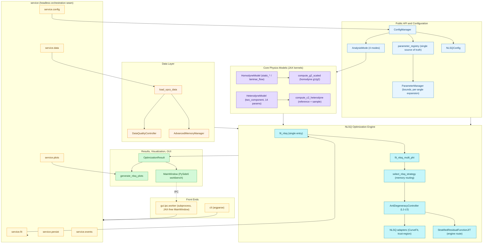

# xpcsjax Architecture

Layered architecture of the xpcsjax package, derived from the graphify knowledge
graph (`graphify-out/GRAPH_REPORT.md`): the named community hubs and the top god
nodes (`AnalysisMode`, `OptimizationResult`, `ConfigManager`, `NLSQConfig`,
`fit_nlsq_multi_phi`, `ParameterManager`, `StratifiedResidualFunctionJIT`).

Data flows top-to-bottom: configuration and raw data enter at the top, the core
physics models and the NLSQ engine sit in the middle, and results / visualization /
GUI consume the fit at the bottom.

## Notes

- **`ConfigManager` + `AnalysisMode`** drive config-based dispatch to the right
  physics model. The four modes are `static_anisotropic`, `static_isotropic`,
  `laminar_flow` (homodyne) and `two_component` (heterodyne).
- **`parameter_registry`** is the single source of truth for parameter names,
  bounds and physical constraints; both `ConfigManager` and the NLSQ bounds
  builder read from it via `ParameterManager`.
- **The engine owns strategy; the upstream NLSQ library owns the solve.**
  xpcsjax routes memory (`select_nlsq_strategy`) and runs the anti-degeneracy
  controller; NLSQ's `CurveFit` performs the trust-region least-squares solve.
- **`OptimizationResult`** is the cross-cutting bridge node (182 edges) consumed
  by visualization and the GUI workbench.
- **`service`** is the headless, argparse/Qt-free orchestration seam shared by
  the CLI and the GUI worker subprocess — both front ends call into
  `service.fit` / `service.data` / `service.config` / `service.plots` rather
  than the optimization/data/config/viz layers directly. `MainWindow` never
  touches JAX; it talks to `gui.ipc.worker` (a separate subprocess) over IPC,
  and the worker is the one that calls into `service`.
