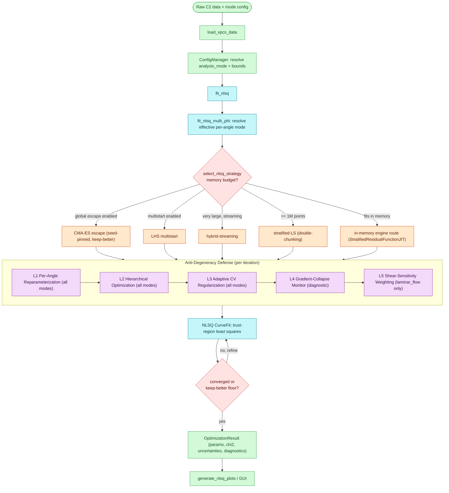

# xpcsjax Fitting Workflow

The NLSQ fitting pipeline, derived from the graphify knowledge graph hyperedges
(`Two-Function Fit Pipeline`, `Heterodyne Memory Tier Dispatch`, `Memory routing
strategy tiers`, `Five-Layer Anti-Degeneracy Stack`) in
`graphify-out/GRAPH_REPORT.md`.

A fit enters through `fit_nlsq`, is routed by memory budget to one of several
strategy paths, and every in-scope path runs the 5-layer anti-degeneracy defense
before producing an `OptimizationResult`.

## Notes

- **Dispatch order** inside the strategy router is: CMA-ES escape -> multistart ->
  hybrid-streaming -> stratified-LS (activates at >= 1M points) -> in-memory
  engine route. The first applicable path wins.
- **Anti-degeneracy layers L1-L4** are active for all analysis modes. **L5
  (shear-sensitivity weighting)** is `laminar_flow`-only by design — the static
  modes have no flow direction and `two_component` (heterodyne) has no shear rate,
  so L5 short-circuits there.
- **L4 is strictly diagnostic**: monitor-on vs monitor-off is bit-identical
  (the homodyne rtol=1e-10 parity baselines included).
- **Global escapes** (CMA-ES / multistart) keep-better vs the plain NLSQ joint fit
  and fall back to it on failure; an escape result is tagged
  `nlsq_diagnostics["global_escape"]` and carries NaN covariance by construction.
- **Engine route**: the in-memory in-scope-mode path routes through the shared
  `StratifiedResidualFunctionJIT` engine for procedural parity between homodyne
  and heterodyne (no-worse SSR, not bit-identical).
